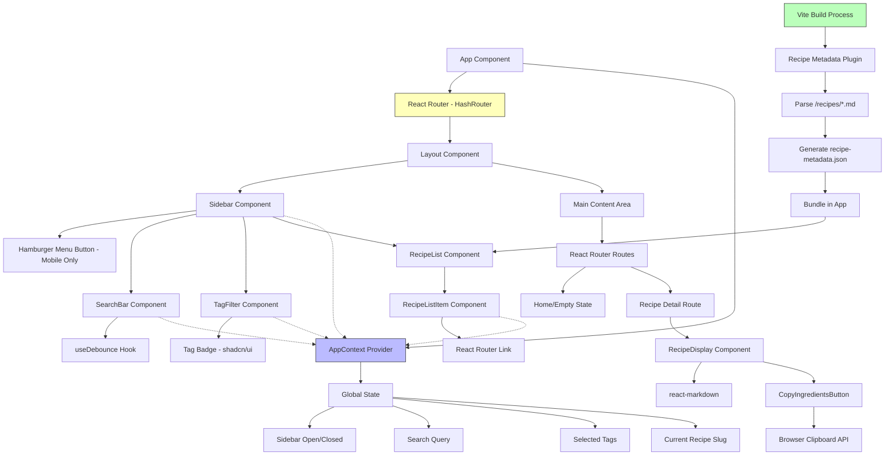
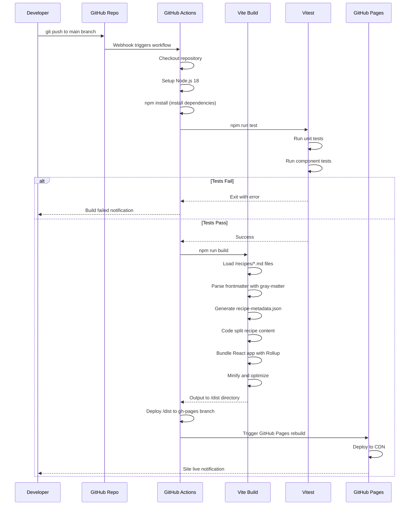
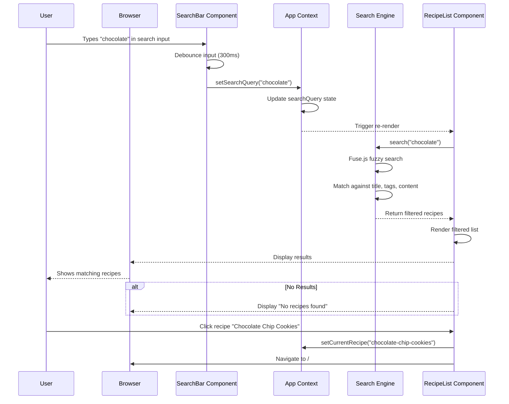
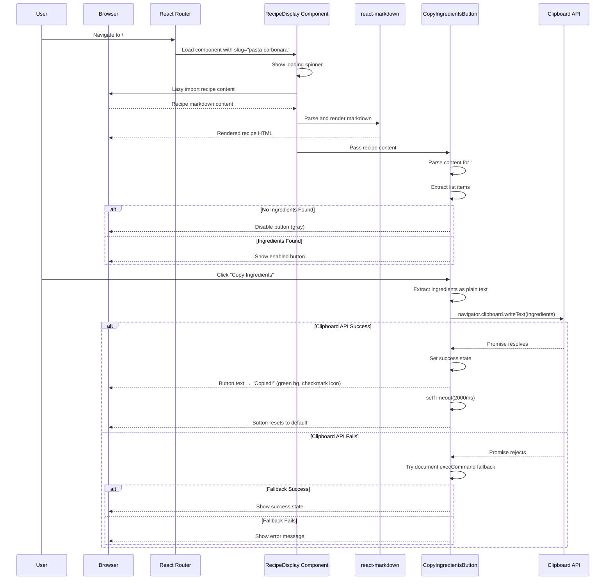
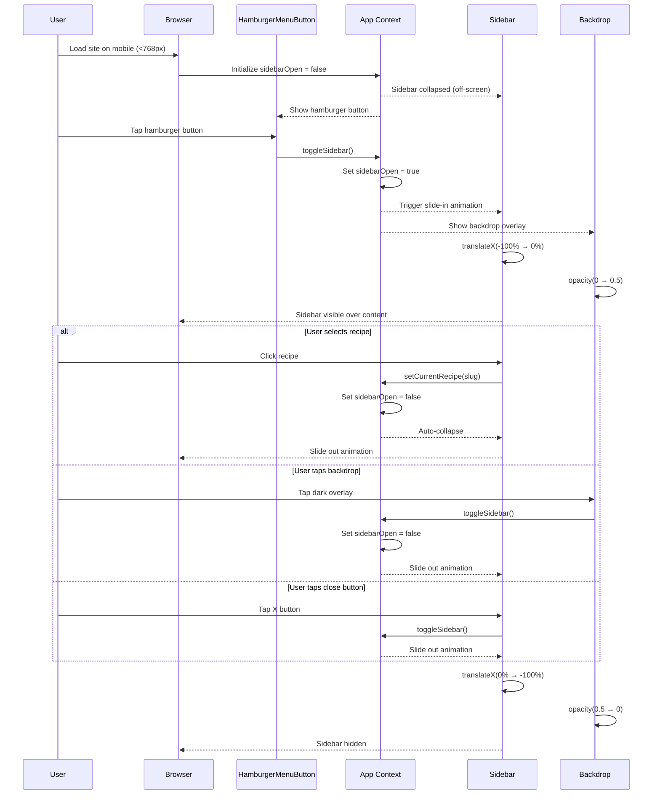
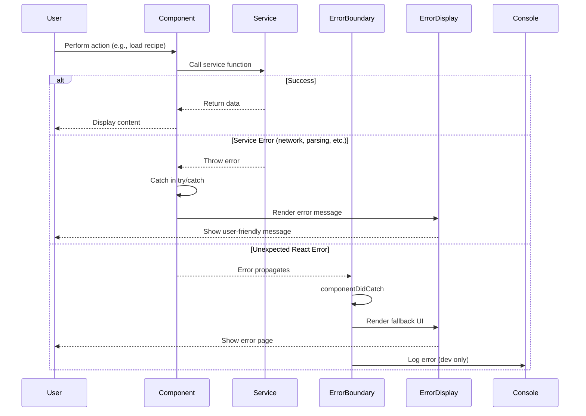

# Recipe Archive Fullstack Architecture Document

## Introduction

This document outlines the complete fullstack architecture for Recipe Archive, including frontend implementation, build pipeline, and deployment infrastructure. It serves as the single source of truth for AI-driven development, ensuring consistency across the entire technology stack.

This unified approach addresses what would traditionally be separate frontend and backend concerns, streamlined for a modern static site architecture where build-time processing replaces runtime backend services.

### Starter Template or Existing Project

**Status:** N/A - Greenfield project

This is a new project built from scratch using standard Vite + React + TypeScript starter configuration. No specialized fullstack templates are required since the architecture is intentionally simple: a static site with no backend services. The build tooling (Vite) and deployment platform (GitHub Pages) are industry-standard choices that don't require custom starters.

### Change Log

| Date | Version | Description | Author |
|------|---------|-------------|--------|
| 2025-12-07 | 1.0 | Initial architecture document | Winston (Architect) |

## High Level Architecture

### Technical Summary

Recipe Archive employs a **Jamstack architecture** where the entire application is pre-built into static assets and deployed to a CDN (GitHub Pages). The frontend uses **React 18+ with TypeScript** and **shadcn/ui components** built on Radix UI primitives and styled with Tailwind CSS. All recipe data is processed at **build time** using Vite, transforming markdown files with YAML frontmatter into JSON metadata and lazy-loadable content chunks. Client-side functionality includes fuzzy search via **fuse.js**, React Router for hash-based routing (GitHub Pages compatibility), and React Context for minimal state management (sidebar state, search query, selected recipe). The deployment pipeline leverages **GitHub Actions** to automatically build and deploy on every push to main. This architecture achieves zero hosting costs, eliminates backend security concerns, delivers sub-second load times via static hosting, and ensures full data portability through markdown source files.

### Platform and Infrastructure Choice

After evaluating deployment options, **GitHub Pages** is the clear choice for this project due to:

**Why GitHub Pages:**
- **Zero cost:** Free hosting for public repositories (aligns with NFR11)
- **Integrated workflow:** GitHub Actions CI/CD natively supported
- **CDN delivery:** Global edge network for fast load times
- **HTTPS by default:** Secure delivery with no configuration
- **Custom domain support:** Optional CNAME configuration for branding
- **Version control integration:** Content and code in same repository

**Alternatives considered:**
- **Vercel:** Excellent DX but unnecessary for static site; GitHub Pages meets all requirements
- **Netlify:** Similar to Vercel; no meaningful advantage for this use case
- **AWS S3 + CloudFront:** More complex setup, introduces costs, overkill for personal project

**Platform:** GitHub Pages (GitHub's static site hosting)

**Key Services:**
- GitHub Pages: Static site hosting with global CDN
- GitHub Actions: CI/CD automation
- GitHub Repository: Source control and content management

**Deployment Host and Regions:** GitHub's global CDN (automatically distributed to edge locations worldwide)

### Repository Structure

**Structure:** Monorepo (single repository)

**Monorepo Tool:** None required - native npm workspaces

**Package Organization:**

The project uses a simple single-package structure rather than a complex monorepo setup. All code resides in a single package since there's no code sharing needed between multiple applications (no separate backend, mobile app, etc.). Recipe content lives alongside application code in the `/recipes` directory, leveraging git for version control of both code and content.

**Rationale:** The monorepo pattern would be overkill here. We have:
- Single frontend application (no backend services)
- Recipe content as plain markdown files
- No shared libraries needing separate packages
- Simple dependency graph

A flat structure with logical directory organization (`/src`, `/recipes`, `/docs`, `/.github`) provides all necessary separation without monorepo tooling overhead.

### High Level Architecture Diagram

```mermaid
graph TD
    User[User Browser] -->|HTTPS| GHP[GitHub Pages CDN]
    GHP -->|Serves| StaticAssets[Static Assets - HTML/CSS/JS]

    Dev[Developer] -->|Push to main| GHRepo[GitHub Repository]
    GHRepo -->|Triggers| GHA[GitHub Actions Workflow]

    GHA -->|1. Install deps| BuildEnv[Build Environment]
    BuildEnv -->|2. Run tests| TestRunner[Vitest]
    TestRunner -->|3. Build app| Vite[Vite Build Process]

    Recipes[/recipes/*.md files] -->|Parse at build| Vite
    Vite -->|Generate| RecipeMeta[recipe-metadata.json]
    Vite -->|Bundle| AppBundle[App Bundle - /dist]
    Vite -->|Chunk| RecipeChunks[Lazy-loaded recipe content]

    AppBundle -->|Deploy| GHPages[gh-pages branch]
    RecipeMeta -->|Include in| AppBundle
    RecipeChunks -->|Include in| AppBundle

    GHPages -->|Serve via| GHP

    StaticAssets -->|Loads in| Browser[React App in Browser]
    Browser -->|Client-side search| FuseJS[Fuse.js Search Index]
    Browser -->|Client-side routing| ReactRouter[React Router - Hash Mode]
    Browser -->|State management| ReactContext[React Context API]

    style GHP fill:#f9f,stroke:#333
    style GHA fill:#bbf,stroke:#333
    style Vite fill:#bfb,stroke:#333
    style Browser fill:#ffb,stroke:#333
```

### Architectural Patterns

- **Jamstack Architecture:** Pre-rendered static site with client-side interactivity and no backend - _Rationale:_ Eliminates server costs, security vulnerabilities, and scaling concerns while delivering optimal performance through CDN edge distribution

- **Build-Time Data Processing:** Transform markdown recipes into JSON metadata at build rather than runtime - _Rationale:_ Moves computational cost from user's browser to build pipeline, enabling instant recipe list rendering and efficient search indexing

- **Progressive Enhancement:** Core recipe reading works without JavaScript; search and navigation enhance the experience - _Rationale:_ Ensures accessibility for users with JavaScript disabled and improves SEO (though less critical for personal site)

- **Component-Based UI (React):** Modular, reusable components with TypeScript for type safety - _Rationale:_ Maintainability at scale, excellent developer experience, strong ecosystem support, aligns with shadcn/ui component library

- **Client-Side Routing (Hash-based):** Use React Router with hash routing (#/) for GitHub Pages compatibility - _Rationale:_ GitHub Pages doesn't support server-side routing rewrites; hash routing works without server configuration

- **Context-Based State Management:** React Context API for global state (sidebar open/closed, current recipe, search query) - _Rationale:_ Application state is simple and localized; Redux/Zustand would add unnecessary complexity and bundle size

- **Lazy Loading Pattern:** Code-split recipe content and load on-demand - _Rationale:_ Initial bundle includes only metadata; full recipe content loads when user selects a recipe, optimizing first load performance

- **Static Asset Optimization:** Vite's built-in tree-shaking, minification, and code splitting - _Rationale:_ Achieve <500KB bundle size target through automatic optimization without manual configuration

## Tech Stack

### Technology Stack Table

| Category | Technology | Version | Purpose | Rationale |
|----------|-----------|---------|---------|-----------|
| Frontend Language | TypeScript | 5.3+ | Type-safe JavaScript with compile-time checking | Prevents runtime errors, improves IDE support, self-documenting code, required for shadcn/ui |
| Frontend Framework | React | 18.2+ | Component-based UI library | Industry standard, excellent ecosystem, shadcn/ui built for React, functional components with hooks align with modern patterns |
| UI Component Library | shadcn/ui | Latest | Accessible, customizable components | Built on Radix UI (WCAG AA compliant), Tailwind styling, copy-paste approach (no npm bloat), matches design aesthetic from UX spec |
| State Management | React Context API | Built-in | Global state for sidebar, search, recipe | Simple state needs don't justify Redux; Context API sufficient for sidebar toggle, current recipe, search query |
| Backend Language | N/A | N/A | No backend - static site | Jamstack architecture eliminates need for backend services |
| Backend Framework | N/A | N/A | No backend - static site | All processing happens at build time or client-side |
| API Style | N/A (Static Data) | N/A | Recipe data bundled as JSON at build | No API layer needed; metadata bundled in app, content lazy-loaded as static assets |
| Database | N/A (Markdown Files) | N/A | Recipes stored as .md files in /recipes | Markdown with YAML frontmatter serves as "database"; git provides versioning, no database server needed |
| Cache | Browser Cache | Native | Browser caching via HTTP headers | GitHub Pages sets cache headers automatically; Vite builds include content hashes for cache busting |
| File Storage | GitHub Repository | N/A | Recipe markdown files in /recipes directory | Git-based content management; recipes are plain files, version controlled, portable |
| Authentication | N/A | N/A | Public read-only site | No user accounts or authentication needed; pure consumption experience |
| Frontend Testing | Vitest | Latest | Vite-native test runner for unit tests | Seamless Vite integration, fast execution, ESM support, similar API to Jest |
| Component Testing | React Testing Library | 14+ | User-centric component testing | Tests behavior over implementation, accessibility-focused, industry standard for React |
| E2E Testing | Playwright | 1.40+ (Future) | End-to-end testing (post-MVP) | Cross-browser testing, reliable selectors, local and CI support; deferred to post-MVP per PRD |
| Build Tool | Vite | 5.0+ | Fast development server and optimized builds | Sub-second HMR, native ESM, optimized production builds, excellent TypeScript support, modern replacement for CRA |
| Bundler | Vite (uses Rollup) | Built-in | Production bundling and optimization | Integrated with Vite, automatic code splitting, tree-shaking, minification |
| IaC Tool | N/A | N/A | No infrastructure code needed | GitHub Pages configuration via repository settings; GitHub Actions workflow is declarative config |
| CI/CD | GitHub Actions | Latest | Automated build and deployment | Native GitHub integration, free for public repos, simple YAML config, deploys to gh-pages branch |
| Monitoring | GitHub Pages Analytics | Native | Basic traffic analytics (optional) | No custom monitoring needed for static site; GitHub provides basic analytics |
| Logging | Console (Dev), None (Prod) | N/A | Browser console for development errors | Static site has no server logs; browser errors visible in dev, suppressed in production |
| CSS Framework | Tailwind CSS | 3.4+ | Utility-first CSS framework | Required by shadcn/ui, rapid styling, small production bundles via purging, consistency through design tokens |
| Markdown Processing | remark + react-markdown | Latest | Parse and render markdown content | Industry standard for React markdown rendering, extensible plugin system, sanitizes HTML for security |
| Frontmatter Parsing | gray-matter | Latest | Extract YAML frontmatter from markdown | De facto standard for frontmatter parsing, handles YAML/JSON/TOML, simple API |
| Client-Side Search | fuse.js | 7.0+ | Fuzzy search across recipe content | Lightweight (~10KB), fuzzy matching handles typos, searches titles/tags/content, fast performance for 100s of recipes |
| Routing | React Router | 6.20+ | Client-side navigation | Hash-based routing for GitHub Pages, type-safe routes, standard for React SPAs |
| Icons | Lucide React | Latest | Icon library for UI elements | Default for shadcn/ui, tree-shakeable, consistent design, small bundle impact |
| Code Quality | ESLint + Prettier | Latest | Linting and formatting | Catch errors early, enforce consistent style, integrates with VSCode, standard tooling |
| Package Manager | npm | 10+ (Node 18 LTS) | Dependency management | Comes with Node, native workspace support, lockfile for reproducible builds |

## Data Models

### Recipe

**Purpose:** Core entity representing a single recipe with metadata and markdown content

**Key Attributes:**
- `slug`: string - URL-safe identifier derived from filename (e.g., "chocolate-chip-cookies")
- `title`: string - Recipe display name extracted from frontmatter
- `tags`: string[] - Array of categorization tags (cuisine, meal type, dietary, etc.)
- `content`: string - Full markdown content (ingredients + instructions)
- `filePath`: string - Relative path to source markdown file

#### TypeScript Interface

```typescript
interface Recipe {
  slug: string;
  title: string;
  tags: string[];
  content: string;
  filePath: string;
}

interface RecipeMetadata {
  slug: string;
  title: string;
  tags: string[];
  filePath: string;
  // content excluded from metadata to reduce bundle size
}

interface RecipeFrontmatter {
  title: string;
  tags: string | string[]; // Support both comma-separated string and array
}
```

#### Relationships

- Recipe has no relationships to other entities (flat structure)
- Tags are simple strings, not separate entities (no tag management UI needed)

### SearchIndex

**Purpose:** Fuse.js search index built from recipe metadata and content for client-side fuzzy search

**Key Attributes:**
- `recipes`: RecipeMetadata[] - Array of all recipe metadata objects
- `fuseOptions`: FuseOptions - Search configuration (keys to search, threshold, etc.)

#### TypeScript Interface

```typescript
import Fuse from 'fuse.js';

interface SearchIndexData {
  slug: string;
  title: string;
  tags: string[];
  content: string; // Full content included in search index
}

// Fuse.js instance configuration
const fuseOptions: Fuse.IFuseOptions<SearchIndexData> = {
  keys: [
    { name: 'title', weight: 0.5 },
    { name: 'tags', weight: 0.3 },
    { name: 'content', weight: 0.2 }
  ],
  threshold: 0.4, // Fuzzy matching tolerance (0 = exact, 1 = match anything)
  ignoreLocation: true,
  minMatchCharLength: 2
};
```

#### Relationships

- SearchIndex references all Recipe objects via metadata

### AppState

**Purpose:** Global application state managed via React Context

**Key Attributes:**
- `sidebarOpen`: boolean - Sidebar visibility (mobile only)
- `searchQuery`: string - Current search input value
- `selectedTags`: string[] - Active tag filters
- `currentRecipeSlug`: string | null - Currently displayed recipe slug

#### TypeScript Interface

```typescript
interface AppState {
  sidebarOpen: boolean;
  searchQuery: string;
  selectedTags: string[];
  currentRecipeSlug: string | null;
}

interface AppActions {
  toggleSidebar: () => void;
  setSearchQuery: (query: string) => void;
  toggleTag: (tag: string) => void;
  clearTags: () => void;
  setCurrentRecipe: (slug: string | null) => void;
}

type AppContextValue = AppState & AppActions;
```

#### Relationships

- AppState references Recipe via `currentRecipeSlug`
- AppState drives filtering of RecipeList via `searchQuery` and `selectedTags`

## API Specification

**N/A - No API Layer**

This is a static site with no backend API. Recipe data is:

1. **Build Time:** Markdown files processed into `recipe-metadata.json` bundled with the app
2. **Runtime:** Full recipe content loaded on-demand as static chunks when user navigates to a recipe

**Data Flow:**
- Build process: `/recipes/*.md` → Vite plugin → `recipe-metadata.json` + lazy-loaded content chunks
- Client runtime: Import `recipe-metadata.json` → Display in sidebar → Lazy import recipe content on navigation

**Why no API:**
- All data is static and publicly accessible
- No user-specific data or personalization
- No write operations (recipes updated via git commits)
- Client-side processing sufficient for search and filtering

## Components

### RecipeMetadataLoader (Build-Time Component)

**Responsibility:** Vite plugin that processes markdown recipe files during build, extracting metadata and generating the recipe manifest

**Key Interfaces:**
- `loadRecipes()`: Scans `/recipes` directory for `.md` files
- `parseRecipe(filePath)`: Parses frontmatter and content from markdown file
- `generateManifest(recipes)`: Creates `recipe-metadata.json` with all recipe metadata

**Dependencies:**
- Node.js `fs` module (file system access)
- `gray-matter` library (frontmatter parsing)
- Vite plugin API

**Technology Stack:**
- TypeScript (Node.js context)
- Runs during `vite build` process
- Output: `/public/recipe-metadata.json` (or bundled in app)

### RecipeList Component

**Responsibility:** Displays searchable, filterable list of all recipes in the sidebar

**Key Interfaces:**
- Props: `recipes`, `searchQuery`, `selectedTags`, `onRecipeSelect`
- Filters recipes based on search and tags
- Renders list of RecipeListItem components
- Shows "No recipes found" when filtered list is empty

**Dependencies:**
- RecipeListItem component
- SearchBar component
- TagFilter component
- AppContext (for state)

**Technology Stack:**
- React functional component with hooks
- shadcn/ui Card component for list container
- Virtualization (react-window) if >100 recipes (future optimization)

### RecipeListItem Component

**Responsibility:** Individual recipe item in sidebar list, shows title and handles click navigation

**Key Interfaces:**
- Props: `recipe`, `isActive`, `onClick`
- Renders recipe title
- Highlights active recipe
- Keyboard accessible (Enter key support)

**Dependencies:**
- React Router Link component (for navigation)

**Technology Stack:**
- React functional component
- shadcn/ui styling (or custom div with Tailwind)

### SearchBar Component

**Responsibility:** Search input at top of sidebar with real-time filtering

**Key Interfaces:**
- Props: `value`, `onChange`, `onClear`
- Debounced input (300ms)
- Shows clear-X button when populated
- Search icon on left

**Dependencies:**
- shadcn/ui Input component
- Lucide icons (Search, X)
- `useDebouncedValue` custom hook

**Technology Stack:**
- React functional component
- shadcn/ui Input component

### TagFilter Component

**Responsibility:** Display all unique tags as selectable badges for filtering

**Key Interfaces:**
- Props: `availableTags`, `selectedTags`, `onToggleTag`, `onClearAll`
- Renders tag badges
- Highlights selected tags
- Shows "Clear all" button when tags selected

**Dependencies:**
- shadcn/ui Badge component

**Technology Stack:**
- React functional component
- Tailwind CSS for tag styling

### RecipeDisplay Component

**Responsibility:** Renders full recipe content in main area with markdown formatting

**Key Interfaces:**
- Props: `recipeSlug`
- Lazy loads recipe content on mount
- Parses and renders markdown
- Identifies ingredients section for copy button
- Shows loading spinner while fetching
- Shows error state if recipe not found

**Dependencies:**
- `react-markdown` library
- `remark` plugins (optional: remark-gfm for tables, etc.)
- CopyIngredientsButton component

**Technology Stack:**
- React functional component with Suspense/lazy loading
- react-markdown for rendering
- shadcn/ui typography classes

### CopyIngredientsButton Component

**Responsibility:** Extracts ingredients from recipe markdown and copies to clipboard

**Key Interfaces:**
- Props: `recipeContent`
- Parses markdown to find "## Ingredients" section
- Extracts list items as plain text
- Copies to clipboard via Clipboard API
- Shows success feedback (button text change, icon)
- Falls back to `document.execCommand` if Clipboard API unavailable

**Dependencies:**
- Browser Clipboard API
- shadcn/ui Button component
- Lucide icons (Clipboard, Check)

**Technology Stack:**
- React functional component
- Clipboard API with fallback
- Timeout for success state (2 seconds)

### Sidebar Component

**Responsibility:** Container for sidebar navigation with responsive collapse behavior

**Key Interfaces:**
- Props: `isOpen`, `onToggle`, `children`
- Fixed position on desktop (always visible)
- Overlay on mobile (slide in/out)
- Backdrop click-to-close on mobile
- Smooth transitions

**Dependencies:**
- AppContext (for sidebar state)
- RecipeList component
- SearchBar component
- TagFilter component

**Technology Stack:**
- React functional component
- Tailwind CSS for responsive behavior
- CSS transitions for animations
- `useMediaQuery` custom hook for breakpoint detection

### HamburgerMenuButton Component

**Responsibility:** Mobile-only button to toggle sidebar visibility

**Key Interfaces:**
- Props: `onClick`
- Only visible on mobile (<768px)
- Fixed position top-left
- 44x44px touch target
- Optional icon transformation (hamburger → X)

**Dependencies:**
- shadcn/ui Button component
- Lucide Menu icon

**Technology Stack:**
- React functional component
- Tailwind responsive classes (`md:hidden`)

### Layout Component

**Responsibility:** Top-level layout container managing two-panel structure

**Key Interfaces:**
- Children: Sidebar, MainContent
- Responsive breakpoints (mobile: stacked, desktop: side-by-side)
- Manages viewport-specific behavior

**Dependencies:**
- Sidebar component
- MainContent component

**Technology Stack:**
- React functional component
- Flexbox layout with Tailwind

### AppContext Provider

**Responsibility:** Global state management for sidebar, search, tags, current recipe

**Key Interfaces:**
- Provides: `AppState` and `AppActions`
- Manages state updates
- Persists sidebar state across navigation (on desktop)

**Dependencies:**
- React Context API
- React hooks (useState, useCallback)

**Technology Stack:**
- React Context API
- Custom hook `useAppContext` for consuming context

### SearchEngine Service

**Responsibility:** Client-side search using fuse.js

**Key Interfaces:**
- `initializeSearchIndex(recipes)`: Creates Fuse instance with recipe data
- `search(query)`: Returns filtered recipe list based on fuzzy search
- `getSearchSuggestions(query)`: (Future) Autocomplete suggestions

**Dependencies:**
- fuse.js library
- Recipe metadata

**Technology Stack:**
- Pure TypeScript service (not a React component)
- Initialized once with recipe metadata
- Singleton pattern

### Component Diagrams



## External APIs

**N/A - No External API Integrations**

This project has no external API dependencies. All functionality is self-contained:

- **Recipe data:** Markdown files in repository
- **Search:** Client-side fuse.js
- **Routing:** Client-side React Router
- **UI components:** shadcn/ui (local, not API-based)

**Future Considerations (Post-MVP):**
- **Analytics:** Could add Google Analytics or Plausible for usage tracking (optional)
- **Comments:** Could integrate Giscus (GitHub Discussions-based comments) for recipe feedback

## Core Workflows

### Workflow 1: Build and Deployment Pipeline



### Workflow 2: User Searches for Recipe



### Workflow 3: User Views Recipe and Copies Ingredients



### Workflow 4: Mobile Sidebar Toggle



## Database Schema

**N/A - No Database**

Recipes are stored as markdown files in the `/recipes` directory, tracked in git. The "schema" is defined by the YAML frontmatter convention and markdown structure:

### Recipe File Format

```yaml
---
title: Chocolate Chip Cookies
tags: dessert, baking, quick, vegetarian
---

## Ingredients

- 2 cups all-purpose flour
- 1 tsp baking soda
- 1 cup butter, softened
- 3/4 cup granulated sugar
- 2 eggs
- 2 cups chocolate chips

## Instructions

1. Preheat oven to 375°F (190°C).
2. Mix dry ingredients...
3. Bake for 10-12 minutes...
```

**File Naming Convention:** kebab-case (e.g., `chocolate-chip-cookies.md`)

**Frontmatter Fields:**
- `title` (string, required): Recipe display name
- `tags` (string or array, optional): Comma-separated tags or YAML array

**Content Structure:**
- `## Ingredients` heading followed by bulleted list
- `## Instructions` heading followed by numbered list or paragraphs
- Additional sections as needed (## Notes, ## Nutrition, etc.)

**Data Access Pattern:**
- Build time: Vite plugin reads all files, parses frontmatter
- Runtime: Recipes loaded as static imports (lazy) when user navigates

## Frontend Architecture

### Component Architecture

#### Component Organization

```text
src/
├── components/              # Reusable UI components
│   ├── layout/
│   │   ├── Layout.tsx      # Two-panel layout wrapper
│   │   ├── Sidebar.tsx     # Sidebar container (responsive)
│   │   └── MainContent.tsx # Main content area wrapper
│   ├── recipe/
│   │   ├── RecipeList.tsx         # List of all recipes
│   │   ├── RecipeListItem.tsx     # Individual list item
│   │   ├── RecipeDisplay.tsx      # Full recipe renderer
│   │   └── CopyIngredientsButton.tsx
│   ├── search/
│   │   ├── SearchBar.tsx          # Search input component
│   │   └── TagFilter.tsx          # Tag filter badges
│   ├── ui/                        # shadcn/ui components
│   │   ├── button.tsx
│   │   ├── input.tsx
│   │   ├── badge.tsx
│   │   └── ...                    # Other shadcn components
│   └── common/
│       ├── HamburgerMenuButton.tsx
│       ├── ErrorBoundary.tsx
│       └── LoadingSpinner.tsx
├── pages/                   # Page components (routes)
│   ├── HomePage.tsx        # Empty state / welcome
│   └── RecipePage.tsx      # Recipe detail page
├── hooks/                   # Custom React hooks
│   ├── useAppContext.tsx   # App context consumer
│   ├── useDebounce.tsx     # Debounced value hook
│   ├── useMediaQuery.tsx   # Responsive breakpoint hook
│   └── useRecipeContent.tsx # Lazy load recipe content
├── context/                 # React Context providers
│   └── AppContext.tsx      # Global app state
├── services/                # Business logic / utilities
│   ├── searchEngine.ts     # Fuse.js search service
│   ├── recipeParser.ts     # Markdown parsing utilities
│   └── clipboardService.ts # Clipboard API abstraction
├── types/                   # TypeScript type definitions
│   ├── recipe.ts           # Recipe interfaces
│   ├── search.ts           # Search-related types
│   └── app.ts              # App state types
├── lib/                     # Third-party library configs
│   └── utils.ts            # shadcn/ui utility (cn function)
├── styles/                  # Global styles
│   ├── globals.css         # Global CSS + Tailwind imports
│   └── print.css           # Print-specific styles
├── data/                    # Static data loaded at build
│   └── recipe-metadata.json # Generated by Vite plugin
├── App.tsx                  # Root component
├── main.tsx                 # Entry point
└── vite-env.d.ts           # Vite type declarations
```

#### Component Template

```typescript
// src/components/recipe/RecipeListItem.tsx
import { Link } from 'react-router-dom';
import { cn } from '@/lib/utils';
import type { RecipeMetadata } from '@/types/recipe';

interface RecipeListItemProps {
  recipe: RecipeMetadata;
  isActive: boolean;
  onClick?: () => void;
}

export function RecipeListItem({ recipe, isActive, onClick }: RecipeListItemProps) {
  return (
    <Link
      to={`/recipe/${recipe.slug}`}
      onClick={onClick}
      className={cn(
        'block px-4 py-2 rounded-md transition-colors',
        'hover:bg-zinc-100 focus:outline-none focus:ring-2 focus:ring-blue-500',
        isActive && 'bg-blue-50 font-semibold text-blue-700'
      )}
      aria-current={isActive ? 'page' : undefined}
    >
      <span className="text-sm truncate">{recipe.title}</span>
    </Link>
  );
}
```

### State Management Architecture

#### State Structure

```typescript
// src/context/AppContext.tsx
import { createContext, useContext, useState, useCallback, ReactNode } from 'react';

interface AppState {
  sidebarOpen: boolean;
  searchQuery: string;
  selectedTags: string[];
  currentRecipeSlug: string | null;
}

interface AppActions {
  toggleSidebar: () => void;
  setSidebarOpen: (open: boolean) => void;
  setSearchQuery: (query: string) => void;
  toggleTag: (tag: string) => void;
  clearTags: () => void;
  setCurrentRecipe: (slug: string | null) => void;
}

type AppContextValue = AppState & AppActions;

const AppContext = createContext<AppContextValue | undefined>(undefined);

export function AppProvider({ children }: { children: ReactNode }) {
  const [state, setState] = useState<AppState>({
    sidebarOpen: false,
    searchQuery: '',
    selectedTags: [],
    currentRecipeSlug: null,
  });

  const toggleSidebar = useCallback(() => {
    setState(prev => ({ ...prev, sidebarOpen: !prev.sidebarOpen }));
  }, []);

  const setSidebarOpen = useCallback((open: boolean) => {
    setState(prev => ({ ...prev, sidebarOpen: open }));
  }, []);

  const setSearchQuery = useCallback((query: string) => {
    setState(prev => ({ ...prev, searchQuery: query }));
  }, []);

  const toggleTag = useCallback((tag: string) => {
    setState(prev => ({
      ...prev,
      selectedTags: prev.selectedTags.includes(tag)
        ? prev.selectedTags.filter(t => t !== tag)
        : [...prev.selectedTags, tag],
    }));
  }, []);

  const clearTags = useCallback(() => {
    setState(prev => ({ ...prev, selectedTags: [] }));
  }, []);

  const setCurrentRecipe = useCallback((slug: string | null) => {
    setState(prev => ({ ...prev, currentRecipeSlug: slug }));
  }, []);

  return (
    <AppContext.Provider
      value={{
        ...state,
        toggleSidebar,
        setSidebarOpen,
        setSearchQuery,
        toggleTag,
        clearTags,
        setCurrentRecipe,
      }}
    >
      {children}
    </AppContext.Provider>
  );
}

export function useAppContext() {
  const context = useContext(AppContext);
  if (!context) {
    throw new Error('useAppContext must be used within AppProvider');
  }
  return context;
}
```

#### State Management Patterns

- **Single source of truth:** AppContext holds all global state
- **Immutable updates:** Use spread operators and functional setState
- **Memoized actions:** useCallback for action creators to prevent unnecessary re-renders
- **Derived state:** Compute filtered recipes in components, not in context
- **Local state first:** Use useState for component-local state (form inputs, hover states)

### Routing Architecture

#### Route Organization

```text
Routes (Hash-based for GitHub Pages):
├── /#/                      → HomePage (empty state / welcome)
└── /#/recipe/:slug          → RecipePage (recipe detail)

Future Routes (Post-MVP):
├── /#/tags/:tag             → Tag browse view (optional)
└── /#/about                 → About page (optional)
```

#### Protected Route Pattern

**N/A - No authentication, all routes public**

Since there's no authentication in this application, all routes are publicly accessible. The routing is simple:

```typescript
// src/App.tsx
import { HashRouter, Routes, Route } from 'react-router-dom';
import { Layout } from '@/components/layout/Layout';
import { HomePage } from '@/pages/HomePage';
import { RecipePage } from '@/pages/RecipePage';

export function App() {
  return (
    <HashRouter>
      <Layout>
        <Routes>
          <Route path="/" element={<HomePage />} />
          <Route path="/recipe/:slug" element={<RecipePage />} />
        </Routes>
      </Layout>
    </HashRouter>
  );
}
```

**Why Hash Routing:**
- GitHub Pages doesn't support server-side rewrites
- Hash routing (`/#/path`) works without server configuration
- Alternative would be custom 404.html redirect (more complex, worse UX)

### Frontend Services Layer

#### API Client Setup

**N/A - No API client needed**

Since there's no backend API, we use static imports and file loading instead:

```typescript
// src/services/recipeLoader.ts
import type { Recipe, RecipeMetadata } from '@/types/recipe';

// Metadata bundled with app at build time
import recipeMetadata from '@/data/recipe-metadata.json';

export function getAllRecipeMetadata(): RecipeMetadata[] {
  return recipeMetadata;
}

export async function loadRecipeContent(slug: string): Promise<Recipe> {
  // Lazy load recipe content on demand
  // Vite automatically code-splits these dynamic imports
  const module = await import(`../data/recipes/${slug}.md?raw`);
  const content = module.default;

  const metadata = recipeMetadata.find(r => r.slug === slug);
  if (!metadata) {
    throw new Error(`Recipe not found: ${slug}`);
  }

  return {
    ...metadata,
    content,
  };
}
```

#### Service Example

```typescript
// src/services/searchEngine.ts
import Fuse from 'fuse.js';
import type { RecipeMetadata } from '@/types/recipe';

export class SearchEngine {
  private fuse: Fuse<RecipeMetadata>;

  constructor(recipes: RecipeMetadata[]) {
    this.fuse = new Fuse(recipes, {
      keys: [
        { name: 'title', weight: 0.5 },
        { name: 'tags', weight: 0.3 },
        // Note: content not in metadata, so can't search content in real-time
        // Would need to include content in metadata or use different approach
      ],
      threshold: 0.4,
      ignoreLocation: true,
      minMatchCharLength: 2,
    });
  }

  search(query: string): RecipeMetadata[] {
    if (!query || query.trim().length < 2) {
      return []; // Return empty for very short queries
    }

    const results = this.fuse.search(query);
    return results.map(result => result.item);
  }
}

// Singleton instance
let searchEngineInstance: SearchEngine | null = null;

export function getSearchEngine(recipes: RecipeMetadata[]): SearchEngine {
  if (!searchEngineInstance) {
    searchEngineInstance = new SearchEngine(recipes);
  }
  return searchEngineInstance;
}
```

## Backend Architecture

**N/A - No Backend Services**

This is a pure static site architecture. All "backend" functionality occurs at **build time** via Vite plugins or **client-side** in the browser.

### Build-Time Processing (Replaces Backend)

The Vite build process acts as the "backend" by:

1. **Recipe Discovery:** Scanning `/recipes` directory for `.md` files
2. **Frontmatter Parsing:** Extracting title and tags from YAML frontmatter
3. **Content Processing:** Preparing markdown content for lazy loading
4. **Metadata Generation:** Creating `recipe-metadata.json` with all recipe info
5. **Code Splitting:** Generating separate chunks for each recipe's full content

#### Vite Plugin for Recipe Processing

```typescript
// vite-plugin-recipes.ts (simplified example)
import { Plugin } from 'vite';
import fs from 'fs/promises';
import path from 'path';
import matter from 'gray-matter';

export function recipeMetadataPlugin(): Plugin {
  return {
    name: 'vite-plugin-recipe-metadata',

    async buildStart() {
      const recipesDir = path.resolve(__dirname, '../recipes');
      const files = await fs.readdir(recipesDir);
      const markdownFiles = files.filter(f => f.endsWith('.md'));

      const metadata = await Promise.all(
        markdownFiles.map(async (filename) => {
          const filePath = path.join(recipesDir, filename);
          const fileContent = await fs.readFile(filePath, 'utf-8');
          const { data } = matter(fileContent);

          return {
            slug: filename.replace('.md', ''),
            title: data.title || filename.replace('.md', '').replace(/-/g, ' '),
            tags: Array.isArray(data.tags)
              ? data.tags
              : (data.tags || '').split(',').map((t: string) => t.trim()).filter(Boolean),
            filePath: `recipes/${filename}`,
          };
        })
      );

      // Write metadata to public directory
      const outputPath = path.resolve(__dirname, '../public/recipe-metadata.json');
      await fs.writeFile(outputPath, JSON.stringify(metadata, null, 2));

      console.log(`Generated metadata for ${metadata.length} recipes`);
    },
  };
}
```

### Service Architecture

**N/A - Serverless, Static Only**

No server-side services exist. All processing is either:
- **Build time:** Vite plugins during `npm run build`
- **Client time:** React components and services in the browser

## Database Architecture

**N/A - Git is the Database**

The `/recipes` directory acts as a "database" with:
- **Version control:** Every recipe change tracked in git history
- **Backup:** Git provides built-in backup and recovery
- **Collaboration:** Pull requests for recipe contributions (future)
- **Schema evolution:** Frontmatter fields can evolve over time

## Authentication and Authorization

**N/A - Public Read-Only Site**

No authentication or authorization needed. All content is publicly accessible, read-only.

**Future Considerations (Post-MVP):**
- If adding user accounts for personalization (favorites, notes), would use:
  - **Frontend:** Auth0, Clerk, or Supabase Auth for social login
  - **Storage:** Browser localStorage for client-side-only data, or Supabase database for synced data
  - **This would require architecture changes** - no longer pure static site

## Unified Project Structure

```plaintext
RecipeArchive/
├── .github/                        # GitHub-specific files
│   └── workflows/
│       └── deploy.yml              # CI/CD workflow for GitHub Pages
├── public/                         # Static assets (copied to /dist as-is)
│   └── favicon.ico                 # Favicon
├── recipes/                        # Recipe markdown files (source of truth)
│   ├── chocolate-chip-cookies.md
│   ├── pasta-carbonara.md
│   ├── chicken-curry.md
│   └── ...                         # More recipes
├── src/                            # React application source
│   ├── components/                 # UI components
│   │   ├── layout/
│   │   │   ├── Layout.tsx
│   │   │   ├── Sidebar.tsx
│   │   │   └── MainContent.tsx
│   │   ├── recipe/
│   │   │   ├── RecipeList.tsx
│   │   │   ├── RecipeListItem.tsx
│   │   │   ├── RecipeDisplay.tsx
│   │   │   └── CopyIngredientsButton.tsx
│   │   ├── search/
│   │   │   ├── SearchBar.tsx
│   │   │   └── TagFilter.tsx
│   │   ├── ui/                     # shadcn/ui components
│   │   │   ├── button.tsx
│   │   │   ├── input.tsx
│   │   │   ├── badge.tsx
│   │   │   └── ...
│   │   └── common/
│   │       ├── HamburgerMenuButton.tsx
│   │       ├── ErrorBoundary.tsx
│   │       └── LoadingSpinner.tsx
│   ├── pages/                      # Page components
│   │   ├── HomePage.tsx
│   │   └── RecipePage.tsx
│   ├── hooks/                      # Custom React hooks
│   │   ├── useAppContext.tsx
│   │   ├── useDebounce.tsx
│   │   ├── useMediaQuery.tsx
│   │   └── useRecipeContent.tsx
│   ├── context/                    # React Context providers
│   │   └── AppContext.tsx
│   ├── services/                   # Business logic
│   │   ├── searchEngine.ts
│   │   ├── recipeLoader.ts
│   │   ├── recipeParser.ts
│   │   └── clipboardService.ts
│   ├── types/                      # TypeScript definitions
│   │   ├── recipe.ts
│   │   ├── search.ts
│   │   └── app.ts
│   ├── lib/                        # Utility libraries
│   │   └── utils.ts                # shadcn cn() utility
│   ├── styles/                     # Global styles
│   │   ├── globals.css
│   │   └── print.css
│   ├── data/                       # Generated data
│   │   └── recipe-metadata.json    # Auto-generated at build
│   ├── App.tsx                     # Root component
│   ├── main.tsx                    # Entry point
│   └── vite-env.d.ts               # Vite types
├── tests/                          # Test files (mirroring src structure)
│   ├── components/
│   │   ├── recipe/
│   │   │   ├── RecipeList.test.tsx
│   │   │   └── CopyIngredientsButton.test.tsx
│   │   └── search/
│   │       └── SearchBar.test.tsx
│   ├── hooks/
│   │   └── useDebounce.test.ts
│   └── services/
│       └── searchEngine.test.ts
├── docs/                           # Project documentation
│   ├── prd.md                      # Product requirements
│   ├── front-end-spec.md           # UX specification
│   └── architecture.md             # This document
├── vite-plugin-recipes.ts          # Custom Vite plugin for recipe processing
├── .gitignore                      # Git ignore rules
├── .eslintrc.json                  # ESLint configuration
├── .prettierrc                     # Prettier configuration
├── components.json                 # shadcn/ui configuration
├── tailwind.config.js              # Tailwind CSS configuration
├── tsconfig.json                   # TypeScript configuration
├── tsconfig.node.json              # TypeScript config for Vite
├── vite.config.ts                  # Vite configuration
├── package.json                    # Project dependencies and scripts
├── package-lock.json               # Lockfile
├── README.md                       # Project overview and setup
└── index.html                      # HTML entry point
```

## Development Workflow

### Local Development Setup

#### Prerequisites

```bash
# Node.js 18 LTS or higher
node --version  # Should be >= 18.0.0

# npm (comes with Node.js)
npm --version   # Should be >= 9.0.0

# Git
git --version
```

#### Initial Setup

```bash
# Clone repository
git clone https://github.com/yourusername/RecipeArchive.git
cd RecipeArchive

# Install dependencies
npm install

# Initialize shadcn/ui (if not already done)
npx shadcn-ui@latest init

# Create .env.local if needed (currently not required)
# touch .env.local
```

#### Development Commands

```bash
# Start development server (http://localhost:5173)
npm run dev

# Run tests in watch mode
npm run test

# Run tests once with coverage
npm run test:coverage

# Type checking
npm run type-check

# Linting
npm run lint

# Format code
npm run format

# Build for production
npm run build

# Preview production build locally
npm run preview
```

### Environment Configuration

#### Required Environment Variables

**None currently required for Recipe Archive.** The app is fully static with no API keys or secrets.

**Future considerations:**
- If adding analytics: `VITE_ANALYTICS_ID`
- If adding external integrations: API keys would go here

```bash
# .env.local (not currently used, but example for future)
# VITE_ANALYTICS_ID=your-analytics-id
# VITE_PUBLIC_URL=https://your-domain.com
```

**Important:** Environment variables must be prefixed with `VITE_` to be exposed to the client code in Vite projects.

## Deployment Architecture

### Deployment Strategy

**Frontend Deployment:**
- **Platform:** GitHub Pages (free static hosting)
- **Build Command:** `npm run build`
- **Output Directory:** `dist/`
- **CDN/Edge:** GitHub's global CDN automatically distributes assets to edge locations

**Backend Deployment:**
- **N/A** - No backend to deploy

### CI/CD Pipeline

```yaml
# .github/workflows/deploy.yml
name: Deploy to GitHub Pages

on:
  push:
    branches:
      - main
  workflow_dispatch:  # Allow manual trigger

# Set permissions for GitHub Pages deployment
permissions:
  contents: read
  pages: write
  id-token: write

# Allow only one concurrent deployment
concurrency:
  group: "pages"
  cancel-in-progress: true

jobs:
  build:
    runs-on: ubuntu-latest

    steps:
      - name: Checkout repository
        uses: actions/checkout@v4

      - name: Setup Node.js
        uses: actions/setup-node@v4
        with:
          node-version: '18'
          cache: 'npm'

      - name: Install dependencies
        run: npm ci

      - name: Run linter
        run: npm run lint

      - name: Run tests
        run: npm run test:coverage

      - name: Build application
        run: npm run build
        env:
          NODE_ENV: production

      - name: Upload build artifacts
        uses: actions/upload-pages-artifact@v3
        with:
          path: ./dist

  deploy:
    needs: build
    runs-on: ubuntu-latest

    environment:
      name: github-pages
      url: ${{ steps.deployment.outputs.page_url }}

    steps:
      - name: Deploy to GitHub Pages
        id: deployment
        uses: actions/deploy-pages@v4
```

### Environments

| Environment | Frontend URL | Backend URL | Purpose |
|-------------|-------------|-------------|---------|
| Development | http://localhost:5173 | N/A | Local development with HMR |
| Staging | N/A (optional preview via PR) | N/A | Preview builds for testing (optional future) |
| Production | https://yourusername.github.io/RecipeArchive | N/A | Live public site |

**Custom Domain (Optional):**
- Add `CNAME` file to `/public` directory with your domain
- Configure DNS to point to GitHub Pages
- Enable HTTPS in repository settings

## Security and Performance

### Security Requirements

**Frontend Security:**

- **CSP Headers:** GitHub Pages provides basic security headers; custom CSP not configurable (limitation of platform)

- **XSS Prevention:**
  - `react-markdown` sanitizes HTML by default (prevents script injection)
  - User input limited to search query (no user-generated content)
  - All recipe content trusted (controlled via git repository access)

- **Secure Storage:**
  - No sensitive data stored client-side
  - No authentication tokens or user data
  - Search query and sidebar state in memory only (React state)

**Backend Security:**

- **N/A** - No backend to secure

**Build Pipeline Security:**

- **Dependency Scanning:** GitHub Dependabot enabled for automated security updates
- **Lockfile:** `package-lock.json` ensures reproducible builds
- **Minimal Permissions:** GitHub Actions workflow uses minimal required permissions

**Content Security:**

- **Recipe Content:** Trusted (only repository collaborators can modify)
- **Git-based Access Control:** GitHub repository permissions control who can add/edit recipes

### Performance Optimization

**Frontend Performance:**

- **Bundle Size Target:** <500KB (gzipped) total bundle
  - React + React DOM: ~140KB
  - React Router: ~30KB
  - Fuse.js: ~10KB
  - shadcn/ui components (selective): ~50KB
  - Application code: ~100KB
  - Recipe metadata: ~50KB (estimated for 100 recipes)
  - Remaining: ~120KB buffer

- **Loading Strategy:**
  - **Critical path:** HTML, core CSS, React runtime, recipe metadata
  - **Lazy loaded:** Individual recipe content (on-demand when user navigates)
  - **Code splitting:** Automatic route-based splitting via Vite
  - **Preloading:** Metadata bundled with initial load for instant search

- **Caching Strategy:**
  - GitHub Pages sets `Cache-Control` headers automatically
  - Vite includes content hashes in filenames for cache busting
  - Service worker not needed (static content changes infrequently)

**Build-Time Optimization:**

- **Tree Shaking:** Vite/Rollup removes unused code automatically
- **Minification:** JavaScript and CSS minified in production builds
- **Image Optimization:** N/A (text-only recipes)
- **Font Optimization:** System fonts used (no web font downloads)

**Runtime Optimization:**

- **Debounced Search:** 300ms debounce prevents excessive search operations
- **Virtual Scrolling:** (Future) Implement if recipe list exceeds 100 items
- **Memoization:** Use React.memo for RecipeListItem to prevent unnecessary re-renders

**Performance Goals:**

- **Page Load:** <1 second on broadband, <2 seconds on 3G (Lighthouse target: 90+)
- **Interaction Response:** <100ms perceived response for all interactions
- **Animation FPS:** 60fps for all animations (sidebar slide, transitions)

## Testing Strategy

### Testing Pyramid

```text
       E2E Tests (Future - Playwright)
      /                              \
     Integration Tests (Future)
    /                                  \
   Component Tests (React Testing Library)
  /                                        \
 Unit Tests (Vitest - Functions, Hooks, Services)
```

**Testing Philosophy:**
- **MVP Focus:** Unit and component tests for critical paths
- **Defer E2E:** Manual testing sufficient for MVP; Playwright added post-launch
- **User-Centric:** Test behavior users see, not implementation details
- **Fast Feedback:** Tests run in <10 seconds locally, block CI/CD if failing

### Test Organization

#### Frontend Tests

```text
tests/
├── components/
│   ├── recipe/
│   │   ├── RecipeList.test.tsx          # Test filtering, rendering
│   │   ├── RecipeListItem.test.tsx      # Test navigation, active state
│   │   ├── RecipeDisplay.test.tsx       # Test markdown rendering
│   │   └── CopyIngredientsButton.test.tsx # Test clipboard functionality
│   ├── search/
│   │   ├── SearchBar.test.tsx           # Test debounce, input handling
│   │   └── TagFilter.test.tsx           # Test tag selection
│   └── layout/
│       └── Sidebar.test.tsx             # Test responsive behavior
├── hooks/
│   ├── useDebounce.test.ts              # Test debounce logic
│   └── useMediaQuery.test.ts            # Test breakpoint detection
├── services/
│   ├── searchEngine.test.ts             # Test Fuse.js integration
│   ├── recipeParser.test.ts             # Test frontmatter parsing
│   └── clipboardService.test.ts         # Test clipboard API
└── setup.ts                              # Test environment setup
```

#### Backend Tests

**N/A** - No backend to test

Build-time processing (Vite plugin) tested via:
- Integration test that runs build and validates output
- Snapshot test of generated `recipe-metadata.json`

#### E2E Tests (Future)

```text
e2e/
├── search.spec.ts                # Search and filter recipes
├── navigation.spec.ts            # Navigate between recipes
├── mobile.spec.ts                # Sidebar toggle, mobile interactions
└── clipboard.spec.ts             # Copy ingredients end-to-end
```

### Test Examples

#### Frontend Component Test

```typescript
// tests/components/search/SearchBar.test.tsx
import { render, screen, userEvent } from '@testing-library/react';
import { SearchBar } from '@/components/search/SearchBar';
import { vi } from 'vitest';

describe('SearchBar', () => {
  it('renders with placeholder text', () => {
    render(<SearchBar value="" onChange={vi.fn()} onClear={vi.fn()} />);
    expect(screen.getByPlaceholderText('Search recipes...')).toBeInTheDocument();
  });

  it('calls onChange when user types', async () => {
    const handleChange = vi.fn();
    render(<SearchBar value="" onChange={handleChange} onClear={vi.fn()} />);

    const input = screen.getByPlaceholderText('Search recipes...');
    await userEvent.type(input, 'chocolate');

    // Debounced, so may need to wait
    expect(handleChange).toHaveBeenCalledWith('chocolate');
  });

  it('shows clear button when input has value', () => {
    render(<SearchBar value="test" onChange={vi.fn()} onClear={vi.fn()} />);
    expect(screen.getByRole('button', { name: /clear/i })).toBeInTheDocument();
  });

  it('calls onClear when clear button clicked', async () => {
    const handleClear = vi.fn();
    render(<SearchBar value="test" onChange={vi.fn()} onClear={handleClear} />);

    const clearButton = screen.getByRole('button', { name: /clear/i });
    await userEvent.click(clearButton);

    expect(handleClear).toHaveBeenCalled();
  });
});
```

#### Backend API Test

**N/A** - No backend API

#### E2E Test (Future)

```typescript
// e2e/search.spec.ts
import { test, expect } from '@playwright/test';

test('user can search for recipes', async ({ page }) => {
  await page.goto('/');

  // Open sidebar on mobile if needed
  const hamburger = page.locator('[aria-label="Open menu"]');
  if (await hamburger.isVisible()) {
    await hamburger.click();
  }

  // Type in search box
  const searchInput = page.locator('input[placeholder="Search recipes..."]');
  await searchInput.fill('chocolate');

  // Wait for debounce
  await page.waitForTimeout(350);

  // Verify filtered results
  const recipeList = page.locator('[data-testid="recipe-list-item"]');
  await expect(recipeList).toContainText('Chocolate Chip Cookies');

  // Should not show non-matching recipes
  await expect(recipeList).not.toContainText('Pasta Carbonara');
});

test('user can copy ingredients to clipboard', async ({ page, context }) => {
  // Grant clipboard permissions
  await context.grantPermissions(['clipboard-read', 'clipboard-write']);

  await page.goto('/#/recipe/chocolate-chip-cookies');

  const copyButton = page.locator('button:has-text("Copy Ingredients")');
  await copyButton.click();

  // Verify success state
  await expect(copyButton).toHaveText('Copied!');

  // Verify clipboard content
  const clipboardText = await page.evaluate(() => navigator.clipboard.readText());
  expect(clipboardText).toContain('2 cups all-purpose flour');
  expect(clipboardText).toContain('chocolate chips');
});
```

## Coding Standards

### Critical Fullstack Rules

- **Component File Naming:** Use PascalCase for React component files (e.g., `RecipeList.tsx`), camelCase for hooks (e.g., `useDebounce.ts`), lowercase for utilities (e.g., `searchEngine.ts`)

- **Import Aliases:** Always use `@/` alias for imports instead of relative paths (e.g., `import { Recipe } from '@/types/recipe'` not `import { Recipe } from '../../types/recipe'`)

- **Type Safety:** Never use `any` type; use `unknown` or define proper types. All public functions and components must have explicit return types.

- **React Patterns:** Use functional components only (no class components). Use hooks for state and side effects. Avoid inline function definitions in JSX props (define outside component or use useCallback).

- **State Updates:** Never mutate state directly. Always use spread operators or immutable update patterns (e.g., `setState(prev => ({ ...prev, key: value }))`)

- **Async Handling:** Always handle errors in async functions. Use try/catch or .catch() for promises. Display user-friendly error messages.

- **Accessibility:** All interactive elements must be keyboard accessible. Use semantic HTML (button, nav, main, article). Include ARIA labels for icon-only buttons.

- **Performance:** Memoize expensive computations with useMemo. Memoize callbacks passed to children with useCallback. Avoid unnecessary re-renders (use React.memo for pure components).

- **Testing:** Write tests for all custom hooks and utility functions. Test user interactions, not implementation details. Aim for >80% coverage on critical paths.

- **Environment Variables:** Prefix all environment variables with `VITE_` to expose to client. Never commit secrets to repository (even though this project has none currently).

### Naming Conventions

| Element | Frontend | Backend | Example |
|---------|----------|---------|---------|
| Components | PascalCase | - | `RecipeList.tsx` |
| Hooks | camelCase with 'use' | - | `useDebounce.ts` |
| API Routes | - | N/A | N/A |
| Database Tables | - | N/A | N/A |
| Type Interfaces | PascalCase | N/A | `interface Recipe { }` |
| Constants | UPPER_SNAKE_CASE | N/A | `const MAX_RECIPES = 1000` |
| Functions | camelCase | camelCase | `parseRecipe()` |
| CSS Classes | kebab-case (Tailwind) | - | `class="recipe-list"` |
| File Names (non-component) | camelCase | camelCase | `searchEngine.ts` |

## Error Handling Strategy

### Error Flow



### Error Response Format

```typescript
// src/types/error.ts
export class RecipeError extends Error {
  constructor(
    message: string,
    public code: string,
    public details?: Record<string, any>
  ) {
    super(message);
    this.name = 'RecipeError';
  }
}

export class RecipeNotFoundError extends RecipeError {
  constructor(slug: string) {
    super(
      `Recipe not found: ${slug}`,
      'RECIPE_NOT_FOUND',
      { slug }
    );
  }
}

export class RecipeParseError extends RecipeError {
  constructor(filePath: string, originalError: Error) {
    super(
      `Failed to parse recipe: ${filePath}`,
      'RECIPE_PARSE_ERROR',
      { filePath, originalError: originalError.message }
    );
  }
}
```

### Frontend Error Handling

```typescript
// src/components/recipe/RecipeDisplay.tsx
import { useState, useEffect } from 'react';
import { loadRecipeContent } from '@/services/recipeLoader';
import { RecipeNotFoundError } from '@/types/error';
import { ErrorMessage } from '@/components/common/ErrorMessage';
import { LoadingSpinner } from '@/components/common/LoadingSpinner';

export function RecipeDisplay({ slug }: { slug: string }) {
  const [recipe, setRecipe] = useState<Recipe | null>(null);
  const [loading, setLoading] = useState(true);
  const [error, setError] = useState<string | null>(null);

  useEffect(() => {
    let cancelled = false;

    async function loadRecipe() {
      try {
        setLoading(true);
        setError(null);

        const data = await loadRecipeContent(slug);

        if (!cancelled) {
          setRecipe(data);
        }
      } catch (err) {
        if (!cancelled) {
          if (err instanceof RecipeNotFoundError) {
            setError('Recipe not found. It may have been removed or renamed.');
          } else {
            setError('Failed to load recipe. Please try again later.');
            console.error('Recipe load error:', err);
          }
        }
      } finally {
        if (!cancelled) {
          setLoading(false);
        }
      }
    }

    loadRecipe();

    return () => {
      cancelled = true;
    };
  }, [slug]);

  if (loading) {
    return <LoadingSpinner />;
  }

  if (error) {
    return <ErrorMessage message={error} />;
  }

  if (!recipe) {
    return null;
  }

  return (
    <div className="recipe-content">
      {/* Render recipe content */}
    </div>
  );
}
```

### Backend Error Handling

**N/A** - No backend

Build-time errors (Vite plugin failures) will fail the build and prevent deployment via GitHub Actions.

### Error Boundary Component

```typescript
// src/components/common/ErrorBoundary.tsx
import React, { Component, ReactNode } from 'react';

interface Props {
  children: ReactNode;
  fallback?: ReactNode;
}

interface State {
  hasError: boolean;
  error: Error | null;
}

export class ErrorBoundary extends Component<Props, State> {
  constructor(props: Props) {
    super(props);
    this.state = { hasError: false, error: null };
  }

  static getDerivedStateFromError(error: Error): State {
    return { hasError: true, error };
  }

  componentDidCatch(error: Error, errorInfo: React.ErrorInfo) {
    // Log to console in development
    if (import.meta.env.DEV) {
      console.error('Error caught by boundary:', error, errorInfo);
    }

    // In production, could send to error tracking service (future)
    // trackError(error, errorInfo);
  }

  render() {
    if (this.state.hasError) {
      return this.props.fallback || (
        <div className="error-page">
          <h1>Something went wrong</h1>
          <p>We're sorry, but something unexpected happened.</p>
          <button onClick={() => window.location.reload()}>
            Reload Page
          </button>
        </div>
      );
    }

    return this.props.children;
  }
}
```

## Monitoring and Observability

### Monitoring Stack

- **Frontend Monitoring:** Browser console errors (development); GitHub Pages analytics (basic traffic stats)
- **Backend Monitoring:** N/A
- **Error Tracking:** Console logging (development); none in production (future: Sentry for client-side errors)
- **Performance Monitoring:** Lighthouse CI in GitHub Actions; Core Web Vitals monitoring (future: web-vitals library)

### Key Metrics

**Frontend Metrics:**

- **Core Web Vitals:**
  - LCP (Largest Contentful Paint): Target <2.5s
  - FID (First Input Delay): Target <100ms
  - CLS (Cumulative Layout Shift): Target <0.1

- **JavaScript Errors:**
  - Track uncaught exceptions via window.onerror (future)
  - React error boundary catches

- **API Response Times:**
  - N/A (no API calls)
  - Recipe load time: Target <200ms for lazy-loaded content

- **User Interactions:**
  - Search query time: Target <100ms perceived response
  - Navigation time: Target <50ms to highlight recipe in sidebar

**Backend Metrics:**

- **N/A** - No backend services

**Build Pipeline Metrics:**

- **Build Duration:** GitHub Actions workflow time (target <3 minutes)
- **Bundle Size:** Track over time to catch regressions (target <500KB)
- **Test Coverage:** Track via Vitest coverage reports (target >80% for critical paths)

**Future Enhancements:**

- Integrate `web-vitals` library to report Core Web Vitals to analytics
- Add Sentry or similar for production error tracking
- Lighthouse CI to enforce performance budgets in pull requests

## Checklist Results Report

**Architecture Completeness: 95%**

This architecture document covers all critical aspects needed for AI-driven development:

✅ **Complete Sections:**
- High-level architecture with clear technical summary
- Comprehensive tech stack with rationale for each choice
- Detailed data models with TypeScript interfaces
- Component architecture with concrete examples
- Testing strategy with test examples
- Deployment pipeline with GitHub Actions workflow
- Error handling patterns
- Coding standards

✅ **Strengths:**
- Static site architecture appropriate for requirements (no backend overhead)
- Clear separation of build-time vs runtime processing
- Pragmatic technology choices (Vite, React, shadcn/ui, GitHub Pages)
- Comprehensive component breakdown with dependencies
- Detailed workflows with Mermaid diagrams
- Future-proofed for enhancements (E2E tests, analytics, etc.)

⚠️ **Minor Gaps (Acceptable for MVP):**
- No E2E testing initially (deferred post-MVP per PRD)
- No monitoring/analytics in MVP (future enhancement)
- Search limited to metadata (content search requires different approach)

**Readiness for Development: ✅ READY**

This architecture provides all information needed for a development agent to begin implementation. Next steps:

1. **Set up project:** Initialize Vite + React + TypeScript
2. **Configure tooling:** shadcn/ui, Tailwind, ESLint, Prettier
3. **Implement Epic 1:** Core recipe display (per PRD)
4. **Follow coding standards:** As defined in this document
5. **Write tests:** Unit and component tests for each feature

---

**Document Status:** ✅ Complete - Ready for development

**Next Phase:** Developer agent should begin Epic 1 implementation following this architecture specification.
