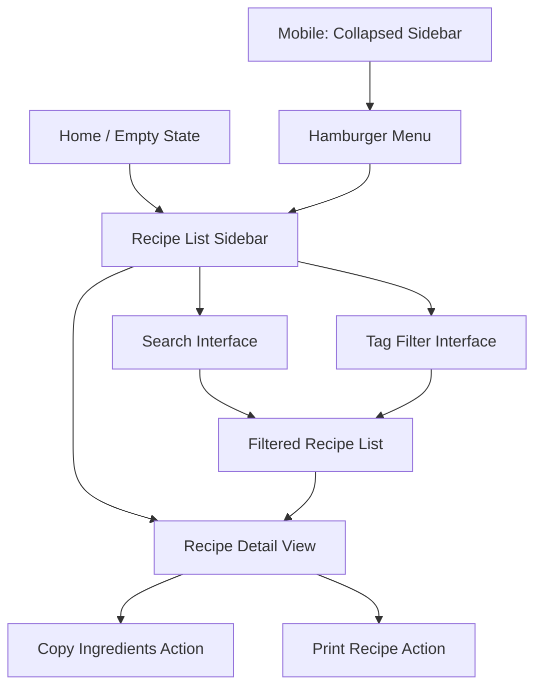
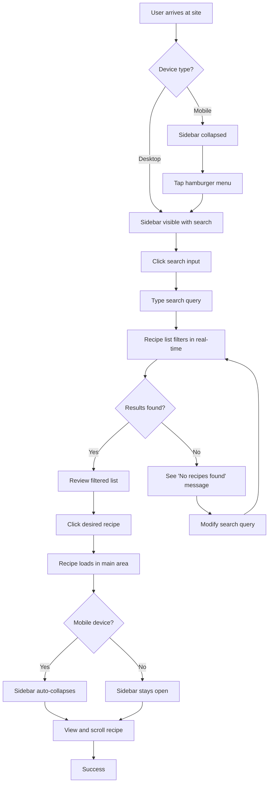
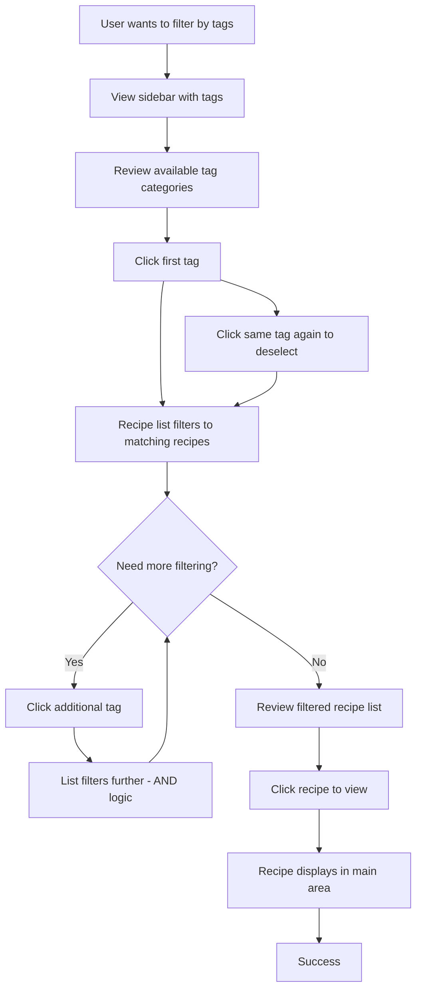
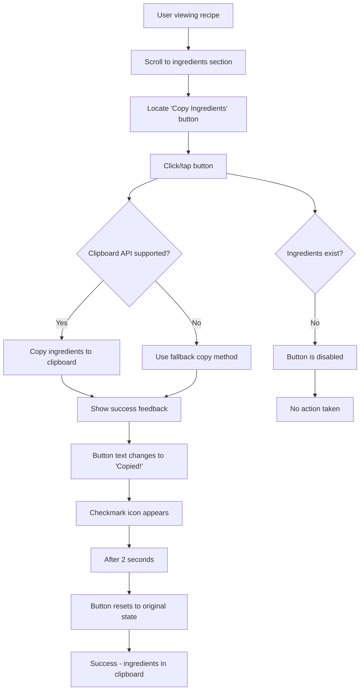
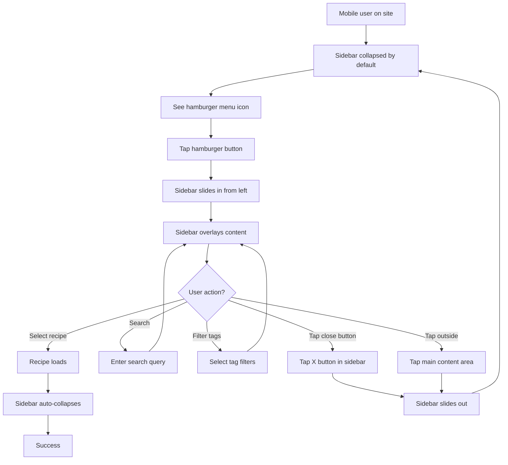

# Recipe Archive UI/UX Specification

## Introduction

This document defines the user experience goals, information architecture, user flows, and visual design specifications for Recipe Archive's user interface. It serves as the foundation for visual design and frontend development, ensuring a cohesive and user-centered experience.

### Overall UX Goals & Principles

#### Target User Personas

**The Active Home Cook**
- Accesses recipes while actively cooking (potentially with messy hands)
- Needs large, readable text visible from counter distance
- Values quick navigation and minimal distractions
- Often references recipes on mobile devices in the kitchen
- Wants to easily copy ingredients for shopping lists

**The Recipe Collector**
- Maintains a personal collection of favorite recipes
- Values organization through tags and search
- Appreciates version control and markdown portability
- Prefers text-focused content over image-heavy layouts
- Wants zero ongoing costs and full data ownership

#### Usability Goals

- **Instant Access:** Users can find any recipe within 5 seconds using search or tag filtering
- **Kitchen-Friendly:** Recipe content is readable from 2-3 feet away on mobile devices
- **One-Handed Mobile Operation:** All primary functions accessible with thumb on mobile
- **Error-Free Browsing:** Search returns relevant results with fuzzy matching for typos
- **Zero Learning Curve:** Interface is intuitive enough that first-time users need no instructions

#### Design Principles

1. **Clarity over cleverness** - Prioritize clear communication over aesthetic innovation; recipes are tools, not art pieces
2. **Content is king** - The recipe text is the star; chrome and navigation should fade into the background
3. **Progressive disclosure** - Show only what's needed when it's needed; collapsed sidebar on mobile, expanded on desktop
4. **Immediate feedback** - Every interaction (search, filter, copy) provides instant visual confirmation
5. **Accessible by default** - WCAG AA compliance from day one; keyboard navigation and screen reader support throughout

### Change Log

| Date | Version | Description | Author |
|------|---------|-------------|--------|
| 2025-12-07 | 1.0 | Initial UI/UX specification | Sally (UX Expert) |

## Information Architecture (IA)

### Site Map / Screen Inventory

**Screen Inventory:**
1. **Home/Empty State** - Welcoming landing view with sidebar visible (desktop) or collapsed (mobile)
2. **Recipe List** - Scrollable list of all recipes in sidebar
3. **Recipe Detail** - Full recipe display in main content area
4. **Search Active** - Sidebar showing filtered results as user types
5. **Tag Filter Active** - Sidebar showing recipes matching selected tag combinations
6. **Mobile Sidebar Overlay** - Expanded sidebar covering main content on mobile

### Navigation Structure

**Primary Navigation:** Sidebar-based navigation serving as the sole navigation mechanism. The sidebar contains the search input, tag filters, and scrollable recipe list. No traditional header navigation or menu structure.

**Secondary Navigation:** None - single-level navigation structure. Recipe detail view has no internal navigation (no tabs or sections).

**Breadcrumb Strategy:** No breadcrumbs needed. Current recipe is highlighted in sidebar list, providing location context. URL reflects current recipe (e.g., `/#/recipe/chocolate-chip-cookies`).

## User Flows

### Flow 1: Finding and Viewing a Recipe by Search

**User Goal:** Quickly find and view a specific recipe by searching for keywords

**Entry Points:**
- Home page with empty main area
- While viewing another recipe

**Success Criteria:** User locates desired recipe and views it in main content area within 10 seconds

#### Flow Diagram

#### Edge Cases & Error Handling

- **Empty search query:** Show all recipes (default state)
- **Search with no results:** Display "No recipes found. Try different keywords or clear your search." message
- **Search with typos:** Fuzzy search handles minor typos (e.g., "choclate" matches "chocolate")
- **Very long search queries:** Input truncates visually but full query processes
- **Special characters in search:** Sanitized but searchable (e.g., searching "jalapeño" works)

**Notes:** Search is case-insensitive and searches across title, tags, and full content. Real-time filtering means results update with every keystroke (debounced for performance).

### Flow 2: Browsing Recipes by Tag Categories

**User Goal:** Discover recipes by browsing tag categories (e.g., all vegetarian dinner recipes)

**Entry Points:**
- Home page
- While viewing a recipe
- After performing a search

**Success Criteria:** User successfully filters recipes by one or more tags and finds desired recipes

#### Flow Diagram

#### Edge Cases & Error Handling

- **No recipes match selected tags:** Display "No recipes match these tags. Try removing a filter." message
- **Tag combination with single result:** Display single recipe in list
- **Clicking tag while search is active:** Tags filter within search results (combined filtering)
- **Deselecting all tags:** Returns to showing all recipes (or search results if search active)
- **Tags with zero recipes:** Tags with no matching recipes are visible but show count of 0

**Notes:** Tag filtering uses AND logic - selecting multiple tags shows recipes that have ALL selected tags. Visual indication shows selected tags with different styling. Optional "Clear all filters" button resets all tag selections.

### Flow 3: Copying Ingredients for Shopping

**User Goal:** Copy all ingredients from a recipe to clipboard for creating a shopping list

**Entry Points:**
- While viewing a recipe detail

**Success Criteria:** All ingredients copied to clipboard with success confirmation, formatted for easy pasting

#### Flow Diagram

#### Edge Cases & Error Handling

- **No ingredients section:** Button is disabled with tooltip "No ingredients found"
- **Clipboard API blocked/unsupported:** Fallback to text selection + document.execCommand('copy')
- **Copy fails:** Show error message "Copy failed. Please select and copy manually."
- **Multiple rapid clicks:** Button disabled during copy operation to prevent multiple triggers
- **Ingredients formatted oddly:** Copy preserves original formatting, one ingredient per line

**Notes:** Copied format includes each ingredient on a new line without markdown formatting (plain text). Button provides immediate visual feedback to confirm successful copy. Works on both desktop and mobile browsers.

### Flow 4: Mobile Sidebar Toggle

**User Goal:** On mobile, toggle sidebar visibility to access navigation while maximizing recipe reading space

**Entry Points:**
- Any page on mobile viewport (<768px)

**Success Criteria:** User can show/hide sidebar smoothly with clear controls and visual feedback

#### Flow Diagram

#### Edge Cases & Error Handling

- **Sidebar open during orientation change:** Sidebar remains open, adapts to new orientation
- **Sidebar open while scrolling:** Sidebar scrolls independently of main content
- **Rapid toggle clicks:** Animation completes before next toggle allowed (debounced)
- **Transition to desktop width:** Sidebar automatically expands and becomes permanent (no collapse)
- **Touch gestures:** Optional swipe-from-left gesture to open sidebar (future enhancement)

**Notes:** Sidebar overlay includes semi-transparent backdrop. Hamburger icon is positioned top-left for thumb accessibility. Animation uses CSS transitions for smooth 60fps performance. State persists during navigation unless user selects a recipe.

## Wireframes & Mockups

**Primary Design Files:** TBD - Figma or similar design tool recommended for high-fidelity mockups

### Key Screen Layouts

#### Desktop: Two-Panel Layout with Recipe Displayed

**Purpose:** Primary desktop experience showing sidebar navigation alongside recipe content

**Key Elements:**
- **Left Sidebar (320px fixed width):**
  - Search input at top with icon
  - Tag filter chips below search
  - Scrollable recipe list with current recipe highlighted
  - Each recipe list item shows title only (no thumbnails)
- **Main Content Area (remaining width, max 800px for readability):**
  - Recipe title as large heading (H1)
  - Recipe content rendered from markdown
  - Ingredients list with clear heading
  - "Copy Ingredients" button positioned at end of ingredients
  - Preparation instructions following ingredients
  - Generous whitespace and readable line length

**Interaction Notes:**
- Sidebar remains visible at all times on desktop
- Recipe list items highlight on hover
- Active recipe has distinct background color in list
- Search input shows clear-X button when populated
- Tag chips toggle selected/unselected on click

**Design File Reference:** [Desktop Layout - Frame 1]

#### Mobile: Collapsed Sidebar with Hamburger Menu

**Purpose:** Mobile experience maximizing content space while keeping navigation accessible

**Key Elements:**
- **Hamburger Menu Icon:**
  - Fixed position top-left corner
  - 44x44px minimum touch target
  - Clear icon (three horizontal lines)
  - Visible on top of recipe content
- **Full-Width Main Content:**
  - Recipe takes entire screen width (with padding)
  - Larger base font size for readability (18px vs 16px desktop)
  - "Copy Ingredients" button full-width on mobile
  - Generous touch targets for all interactive elements

**Interaction Notes:**
- Tapping hamburger slides sidebar in from left
- Backdrop overlay dims main content when sidebar open
- Tapping backdrop or selecting recipe closes sidebar
- Sidebar has close X button in top-right corner
- All sidebar interactions work the same as desktop

**Design File Reference:** [Mobile Layout - Frame 2]

#### Mobile: Expanded Sidebar Overlay

**Purpose:** Sidebar navigation view on mobile devices

**Key Elements:**
- **Sidebar Overlay (280px width):**
  - Slides in from left edge
  - Search input at top
  - Tag filters below search
  - Scrollable recipe list
  - Close X button in top-right of sidebar
- **Backdrop:**
  - Semi-transparent dark overlay (rgba(0,0,0,0.5))
  - Covers main content
  - Tappable to close sidebar
- **Animation:**
  - Smooth slide-in transition (250ms ease-out)
  - Backdrop fades in simultaneously

**Interaction Notes:**
- Sidebar scrolls independently if content exceeds viewport
- Search and tag filters work identically to desktop
- Selecting a recipe auto-closes sidebar and navigates
- Swipe-right gesture to close (future enhancement)

**Design File Reference:** [Mobile Sidebar - Frame 3]

#### Empty State / Home View

**Purpose:** Initial landing state before any recipe is selected

**Key Elements:**
- **Sidebar:** Fully functional with search, tags, and recipe list
- **Main Content Area (centered):**
  - Welcome message: "Recipe Archive"
  - Subtitle: "Select a recipe from the sidebar to get started"
  - Optional: Brief instructions on using search and tags
  - Minimalist, clean presentation

**Interaction Notes:**
- On first visit, hints user to explore sidebar
- No intrusive onboarding or modals
- Sidebar takes visual priority to guide user

**Design File Reference:** [Empty State - Frame 4]

## Component Library / Design System

**Design System Approach:** Use shadcn/ui as the foundation, leveraging its Radix UI primitives and Tailwind CSS integration. Components will be installed individually as needed and customized minimally to maintain the shadcn aesthetic. No custom design system needed - shadcn provides the consistency and accessibility required.

### Core Components

#### Search Input

**Purpose:** Primary discovery mechanism for finding recipes by keyword

**Variants:**
- Default state (empty)
- Focused state (with focus ring)
- Populated state (with clear button)
- Disabled state (not used in this app)

**States:**
- Default: Light gray background, subtle border, search icon on left
- Focus: Border color changes to accent color, focus ring visible
- Populated: Clear-X button appears on right side
- Error/No Results: No visual change to input itself (message shown below)

**Usage Guidelines:**
- Always visible at top of sidebar
- Placeholder text: "Search recipes..."
- Debounced input (300ms) to avoid excessive filtering
- Auto-focus on desktop when sidebar opens
- Clear button removes all search text and resets list

**Technical:** shadcn/ui Input component with custom search icon and clear button

#### Tag Badge / Chip

**Purpose:** Display and filter recipes by category tags

**Variants:**
- Unselected (default)
- Selected (active filter)
- Hover state

**States:**
- Unselected: Light gray background, dark text, subtle border
- Selected: Accent color background, white text, no border
- Hover: Slightly darker background, pointer cursor
- Disabled: Not applicable (all tags always interactive)

**Usage Guidelines:**
- Displayed below search input in sidebar
- Tags wrap to multiple rows if needed
- Alphabetically sorted within categories (if categorized)
- Click toggles selection state
- Multiple tags can be selected simultaneously
- Optional badge count showing number of recipes per tag

**Technical:** shadcn/ui Badge component with custom selection state styling

#### Recipe List Item

**Purpose:** Display individual recipe in sidebar navigation list

**Variants:**
- Default (unselected)
- Active (currently displayed recipe)
- Hover state

**States:**
- Default: White/transparent background, standard text color
- Active: Subtle background color (accent tint), bold text
- Hover: Light background highlight, pointer cursor
- Focus: Keyboard focus ring for accessibility

**Usage Guidelines:**
- List items are full-width within sidebar
- Text-only (no thumbnails or metadata)
- Single line with ellipsis if title too long
- Click navigates to recipe detail
- Active recipe always visible (auto-scroll if needed)

**Technical:** Custom component using shadcn Card or basic div with link styling

#### Button (Copy Ingredients)

**Purpose:** Copy recipe ingredients to clipboard with user feedback

**Variants:**
- Primary action button
- Success state (temporary after copy)

**States:**
- Default: Accent color background, white text, with clipboard icon
- Hover: Slightly darker background
- Active (pressed): Even darker, slight scale transform
- Success: Green background, checkmark icon, "Copied!" text (2 second duration)
- Disabled: Gray background, lower opacity (when no ingredients found)

**Usage Guidelines:**
- Positioned directly after ingredients section
- Full-width on mobile, inline on desktop
- Icon on left, text on right
- Success state auto-reverts to default after 2 seconds
- Disabled state has tooltip explaining why

**Technical:** shadcn/ui Button component with custom success state transition

#### Hamburger Menu Button

**Purpose:** Toggle sidebar visibility on mobile viewports

**Variants:**
- Default (sidebar closed)
- Active (sidebar open - optional X icon transformation)

**States:**
- Default: Three horizontal lines icon, dark color
- Hover/Active: Slight background highlight
- Pressed: Touch feedback animation

**Usage Guidelines:**
- Only visible on mobile viewports (<768px)
- Fixed position top-left corner with z-index above content
- Minimum 44x44px touch target
- High contrast against background
- Animation to X icon when sidebar opens (optional enhancement)

**Technical:** shadcn/ui Button component with icon, custom positioning

#### Main Content Container

**Purpose:** Render recipe markdown content with consistent styling

**Variants:** N/A (single variant, content-driven)

**States:**
- Loading: Skeleton placeholder or spinner
- Loaded: Rendered markdown content
- Error: Error message display

**Usage Guidelines:**
- Max-width 800px for optimal readability
- Centered with auto margins on desktop
- Full-width with padding on mobile
- Vertical rhythm through consistent spacing
- Typography scale follows shadcn standards

**Technical:** Custom component using react-markdown with shadcn typography classes

## Branding & Style Guide

### Visual Identity

**Brand Guidelines:** No formal brand identity for Recipe Archive. Following shadcn/ui's neutral, developer-friendly aesthetic with emphasis on typography and whitespace over heavy branding.

### Color Palette

| Color Type | Hex Code | Usage |
|------------|----------|-------|
| Primary | `#09090b` (Zinc-950) | Primary text, headings |
| Secondary | `#71717a` (Zinc-500) | Secondary text, placeholders |
| Accent | `#3b82f6` (Blue-500) | Links, active states, focus rings, primary button |
| Success | `#22c55e` (Green-500) | Positive feedback, confirmations, "Copied!" state |
| Warning | `#f59e0b` (Amber-500) | Cautions, important notices (minimal usage) |
| Error | `#ef4444` (Red-500) | Errors, destructive actions (minimal usage) |
| Neutral | `#f4f4f5` (Zinc-100), `#e4e4e7` (Zinc-200), `#d4d4d8` (Zinc-300) | Backgrounds, borders, dividers |

**Note:** Colors follow Tailwind's Zinc palette for neutral tones and standard color scale for accent colors, maintaining shadcn's restrained aesthetic.

### Typography

#### Font Families

- **Primary:** Inter, -apple-system, BlinkMacSystemFont, "Segoe UI", Roboto, sans-serif
- **Secondary:** (Same as primary - single font family approach)
- **Monospace:** "SF Mono", Monaco, "Cascadia Code", "Roboto Mono", monospace (for any code snippets in recipes)

#### Type Scale

| Element | Size | Weight | Line Height |
|---------|------|--------|-------------|
| H1 | 36px (2.25rem) | 700 (Bold) | 1.2 (43px) |
| H2 | 24px (1.5rem) | 600 (Semi-bold) | 1.3 (31px) |
| H3 | 20px (1.25rem) | 600 (Semi-bold) | 1.4 (28px) |
| Body | 16px (1rem) desktop, 18px (1.125rem) mobile | 400 (Regular) | 1.6 (26px desktop, 29px mobile) |
| Small | 14px (0.875rem) | 400 (Regular) | 1.5 (21px) |

**Mobile Adjustments:**
- Body text increases to 18px for better readability while cooking
- H1 may reduce slightly on very small screens (32px)
- Line height generous for scanning while standing at counter

### Iconography

**Icon Library:** Lucide Icons (default for shadcn/ui)

**Usage Guidelines:**
- 20px default size for inline icons (search, close, hamburger)
- 24px for standalone action icons (clipboard, checkmark)
- Single consistent stroke width (2px)
- Use sparingly - only where they enhance understanding
- Key icons: Search, X (close), Menu (hamburger), Clipboard, Check, Filter

### Spacing & Layout

**Grid System:** No complex grid - simple flexbox layouts with consistent spacing scale

**Spacing Scale:** Tailwind's default spacing scale (based on 0.25rem = 4px increments)
- `xs`: 4px (0.25rem) - tight inline spacing
- `sm`: 8px (0.5rem) - compact element spacing
- `md`: 16px (1rem) - standard spacing between elements
- `lg`: 24px (1.5rem) - section spacing
- `xl`: 32px (2rem) - major section spacing
- `2xl`: 48px (3rem) - top-level section spacing

**Layout Guidelines:**
- Sidebar: 320px fixed width on desktop
- Main content: max-width 800px for text readability
- Padding: 16px on mobile, 24px on tablet, 32px on desktop
- Component gaps: 16px default, 24px between major sections

## Accessibility Requirements

### Compliance Target

**Standard:** WCAG 2.1 Level AA compliance

### Key Requirements

**Visual:**
- Color contrast ratios: Minimum 4.5:1 for normal text, 3:1 for large text (18px+ bold or 24px+ regular)
- Focus indicators: 2px solid accent color outline on all interactive elements, clearly visible against all backgrounds
- Text sizing: Minimum 16px body text (18px on mobile), user can zoom to 200% without loss of functionality

**Interaction:**
- Keyboard navigation: All functionality accessible via keyboard; logical tab order; Enter/Space activate buttons; Escape closes mobile sidebar
- Screen reader support: Semantic HTML (nav, main, article); ARIA labels for icon-only buttons; live regions announce filter changes and copy success
- Touch targets: Minimum 44x44px for all tappable elements on mobile; adequate spacing between adjacent tap targets

**Content:**
- Alternative text: All meaningful images have descriptive alt text (N/A for text-only recipe site)
- Heading structure: Logical hierarchy (single H1 per page, no skipped levels, H2 for major sections)
- Form labels: Search input has visible label or clear aria-label; form controls properly labeled

### Testing Strategy

**Automated Testing:**
- Lighthouse accessibility audit (target 90+ score)
- axe DevTools browser extension during development
- Pa11y CI in GitHub Actions workflow

**Manual Testing:**
- Keyboard-only navigation walkthrough of all user flows
- Screen reader testing with NVDA (Windows) and VoiceOver (Mac/iOS)
- Color contrast verification with WebAIM Contrast Checker
- Mobile touch target size verification

**Ongoing:**
- Accessibility checks in code review process
- User testing with assistive technology users (if possible)

## Responsiveness Strategy

### Breakpoints

| Breakpoint | Min Width | Max Width | Target Devices |
|------------|-----------|-----------|----------------|
| Mobile | - | 767px | Phones (portrait and landscape) |
| Tablet | 768px | 1023px | Tablets, small laptops |
| Desktop | 1024px | 1439px | Standard laptops, desktops |
| Wide | 1440px | - | Large desktops, external monitors |

### Adaptation Patterns

**Layout Changes:**
- **Mobile (<768px):** Single-column layout with collapsible overlay sidebar; full-width content
- **Tablet (768-1023px):** Two-column layout with narrower sidebar (280px); touch-optimized interactions remain
- **Desktop (1024px+):** Two-column layout with standard sidebar (320px); permanent sidebar visibility
- **Wide (1440px+):** Content max-width constrains to 800px; additional whitespace on sides

**Navigation Changes:**
- **Mobile:** Hamburger menu button reveals overlay sidebar; sidebar auto-closes on recipe selection
- **Tablet+:** Sidebar always visible; no hamburger menu; sidebar remains open during navigation

**Content Priority:**
- **Mobile:** Recipe content is full-width to maximize readability; ingredients button full-width for easy tapping
- **Tablet+:** Content maintains max-width for readability; ingredients button inline, left-aligned

**Interaction Changes:**
- **Mobile:** Touch-optimized with 44px minimum targets; larger font size (18px body); swipe gestures (future)
- **Desktop:** Hover states enabled; keyboard shortcuts possible; smaller touch targets acceptable (mouse precision)

## Animation & Micro-interactions

### Motion Principles

**Purposeful Motion:** Animations serve functional purposes - providing feedback, guiding attention, or indicating state changes. No animation for decoration alone.

**Subtle and Fast:** Transitions are quick (150-300ms) and subtle to avoid feeling sluggish. Users should barely notice the animation consciously but feel the interface is responsive.

**Respect Reduced Motion:** All animations respect `prefers-reduced-motion: reduce` media query, falling back to instant state changes for users who prefer minimal motion.

**Performance First:** All animations use GPU-accelerated properties (transform, opacity) to maintain 60fps. No animating of layout properties that trigger reflow.

### Key Animations

- **Sidebar slide-in (mobile):** Sidebar translates from -100% to 0% on X-axis (Duration: 250ms, Easing: ease-out)
- **Backdrop fade (mobile):** Overlay opacity transitions from 0 to 0.5 (Duration: 250ms, Easing: ease-out)
- **Tag selection:** Background color and text color transition smoothly (Duration: 150ms, Easing: ease-in-out)
- **Button hover:** Subtle background color shift and scale transform 1.02 (Duration: 150ms, Easing: ease-out)
- **Copy success feedback:** Button background transitions to green with icon fade-in (Duration: 200ms, Easing: ease-in), then fades back after 2 seconds (Duration: 300ms, Easing: ease-out)
- **Recipe list item hover:** Background color subtle highlight (Duration: 100ms, Easing: ease-in-out)
- **Search results filter:** Smooth list item fade-in/out as results change (Duration: 200ms, Easing: ease-in-out)
- **Focus ring appearance:** Instant (0ms) for accessibility - no animation delay on focus states

## Performance Considerations

### Performance Goals

- **Page Load:** Initial page load under 2 seconds on 3G connection; under 1 second on broadband
- **Interaction Response:** All interactions (search, tag filter, navigation) respond within 100ms (perceived as instant)
- **Animation FPS:** All animations maintain 60fps on mid-range mobile devices (no jank)

### Design Strategies

**Minimize Bundle Size:**
- Use code splitting to lazy-load recipe content
- Install only required shadcn/ui components (not entire library)
- Optimize icon usage - include only needed icons from Lucide
- Target: <500KB total bundle size (gzipped)

**Optimize Search Performance:**
- Debounce search input (300ms) to reduce filter operations
- Use virtual scrolling for recipe list if collection exceeds 100 recipes
- Pre-build search index at build time where possible

**Reduce Layout Shift:**
- Define explicit heights for loading states
- Use CSS aspect ratios if any images added in future
- Prevent sidebar toggle from shifting main content (overlay vs push)

**Progressive Enhancement:**
- Core functionality (reading recipes) works without JavaScript
- Search and filtering enhance the experience but aren't blocking
- Print styles work regardless of interactive state

**Perceived Performance:**
- Show loading skeletons instead of blank screens
- Optimistic UI updates (highlight selection before processing)
- Instant visual feedback on all interactions
- Prioritize above-the-fold content loading

## Next Steps

### Immediate Actions

1. **Stakeholder Review** - Share this specification with project stakeholders for feedback and approval
2. **Create High-Fidelity Mockups** - Use Figma to create detailed visual designs for key screens based on wireframes
3. **Component Prototyping** - Build interactive prototypes of key interactions (sidebar toggle, search, copy button) for user testing
4. **Accessibility Audit Planning** - Set up automated accessibility testing in development workflow
5. **Handoff to Architect** - Provide this specification to the frontend architect for technical architecture design

### Design Handoff Checklist

- [x] All user flows documented
- [x] Component inventory complete
- [x] Accessibility requirements defined
- [x] Responsive strategy clear
- [x] Brand guidelines incorporated
- [x] Performance goals established

---

**Document Status:** ✅ Complete - Ready for architect review and high-fidelity design phase

**Next Agent:** Frontend Architect should review this specification and create technical architecture document defining component structure, state management, routing implementation, and build pipeline.